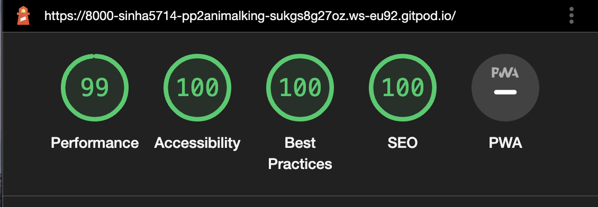

# Animal Kingdom
- Animal Kindom is a quiz game for kids to learn and choose what kind of animal is provided in the image as question.
- User is provided with the rules of the game - How to play and also a high score area.
- User can add their name before starting to play the quiz.
- User can also restart the game if they are not satisfied with their performance.
- User of this website will be able to play this game multiple times and add their score to see their development.

[Link to the website](https://sinha5714.github.io/pp2-animal-kingdom/)


## Contents
[UX](#ux)
 - [User Stories](#user-stories)
 - [Site Owner Goals](#site-owner-goals)
 - [Potential Features](#potential-features)
 - [Wireframes](#wireframes)
- [Features](#features)
  - [Existing Features](#existing-features)
  - [Features to be implemented](#features-to-be-implemented)
- [Testing](#testing)
  - [Lighthouse](#lighthouse)
  - [Tested Devices with Browsers](#tested-devices-with-browsers)
  - [Validator Testing](#validator-testing)
  - [Unfixed bugs](#unfixed-bugs)
- [Deployment](#deployment)
- [Credits](#credits)
  - [Content](#content)
  - [Media](#media)
  - [Code](#code)
- [Thank You](#thank-you)

## UX
### User Stories
- Learn to identify animals
- Play a quiz game
- Become a top scorer
- Able to restart the quiz
- Able to use in different media 
### Site Owner Goals
- Website for a quiz game for kids
- Rules for the quiz
- Timer element for the quiz
- Score obtain by the user
- Identifying animals quiz for kids
- Able to select option and know its correct or wrong
- Add their name to the game
- Save their score in the high score table
- Able to see the image questions in all devices
### Potential Features
- Main Page
- Rules for the Quiz
- Username Entry Page
- High Score Page
- Quiz Area
- End Page after Quiz Completion


### Wireframes
- A low-fi wireframe was build before developing the website.
- This was done in Balsamiq Wireframes. 


 The link for the wireframes for this site can be found [here](https://github.com/Sinha5714/pp2-animal-kingdom/blob/main/assets/images/wireframes)


## Features
### Existing Features

#### Main Page
- The main page will be displayed once the website is open.
- It consists of a heading, a small description of the game and three buttons.
- Each button has seperate function:
    - Play button : Opens the Username entry page
    - How to Play button : Opens the rules page of the quiz
    - High Scores button : Opens the page for high score table
    
  

#### Rules for the Quiz
  - This page opens once the "How To Play" button is clicked on main-page.
  - This page consists of rules about how to play the game and a "Home" button.
  - Once the Home button is clicked, user goes back to the main-page.


#### Username Entry Page
- This page opens when "Play" button is clicked in the main page.
- This page consists of a heading, an input field for user to enter the name and a "Start Game" button.
- Once the "Start Game" button is clicked user can start playing the quiz.


#### High Score Page
- This page opens when "High Scores" button is clicked in main page.
- This page consists of a heading, a table with Table heading of "USERNAME" and "SCORES" and a Home button.
- Once the "Home" button is clicked, user will go back to main-page.


#### Quiz Area
- This page opens when "Start Game" button is clicked in Username Entry Page.
- This page consists of the following:
    - A heading
    - A welcome message with Username value in it
    - An area for question image
    - Four option buttons
    - Restart button
    - Next button
    - Score area
    - Timer 
- Once the page is loaded, the timer starts with a coundown of 15 seconds for user to choose an option.
- The score is 10 for per correct answer and will be displayed in the score area.
- Next button is to go to the next question.
- Restart button is provided for user to restart the game in the same quiz page. 


#### End Page after Quiz Completion 
- This page opens automatically after the 10 quiz questions have been played.
- This page consists of :
    - A heading
    - A congratulation message: 
        - Number of total correct question attempted
        - Score obtained by the user
    - Save High Score button
    - Home button
- Once "Save High Score" button is clicked, username and scores will be added to the high score table and "High Score Page" will be opened.


### Features to be implemented
- More question images
- Sound for the game
- An online multiplayer quiz competition

## Testing
- I tested that this page works in different browsers - Chrome and Safari

### Lighthouse
- The deployed website was also tested with Google Chrome's Lighhouse feature and all scores have been above 90 for both mobile and desktop.

#### For Desktop 



#### For Mobile 


### Tested Devices with Browsers
- iPhone 12
    - Safari
- Samsung S22 Ultra
    - Chrome
- Macbook Pro 2019 16-inch
    - Chrome
    - Safari
- Also tested various device sizes using [Dev.tools](https://developer.chrome.com/docs/devtools/)

### Validator Testing

#### HTML
- No errors were returned when passing through the official [W3C validator](https://validator.w3.org/)


#### CSS
- No errors were found when passing through the official [(Jigsaw) validator](https://jigsaw.w3.org/css-validator/)


#### JS
- Warnings were provided regarding unused function. These functions are called in index.html in buttons using "onclick" attribute.


### Unfixed Bugs
- No unfixed bugs.

## Deployment

### Deploying the website to GitHub Pages:
The site was deployed to GitHub pages. The steps to deploy are as follows:
- In the GitHub repository, navigate to the Settings tab
- From the source section drop-down menu, select the Master Branch
- Once the master branch has been selected, the page will be automatically refreshed with a detailed ribbon display to indicate the successful deployment.

The live link can be found here - https://sinha5714.github.io/Underwater_Explorer/

### Cloning the repository
1. Visit the GitHub page of the website’s repository
2. Click the “Clone” button on top of the page
3. Click on “HTTPS”
4. Click on the copy button next to the link to copy it
5. Open your IDE
6. Type ```git clone <copied URL>``` into the terminal

## Credits

### Content
- The text content was provided by the site owner.
- The fonts of the content was taken from [google fonts](https://fonts.google.com/)
- The icon has been taken from [fontawesome.com](https://fontawesome.com/v6/docs/) 

### Media
- The images in the website including gallery and background are taken from [pexels.com](https://www.pexels.com/)

### Code
#### The following code ideas were borrowed from [Love Maths](https://github.com/Sinha5714/love_Maths)

-  Increment Score function

#### The following idea was a help from my Sister

-  Splicing used question so that it does not repeat

#### The following code idea was taken from google search

- setAttribute("disabled", "disabled");

#### Following code was provided by student in slack community

- countdown();

### Thank You
- to my mentor Cans for supporting me with his feedback through the entire project
- to my Sister(Manisha Sinha) who helped with the code
- to Code Institute and Slack community for helping me when I was getting stuck with some challenges.